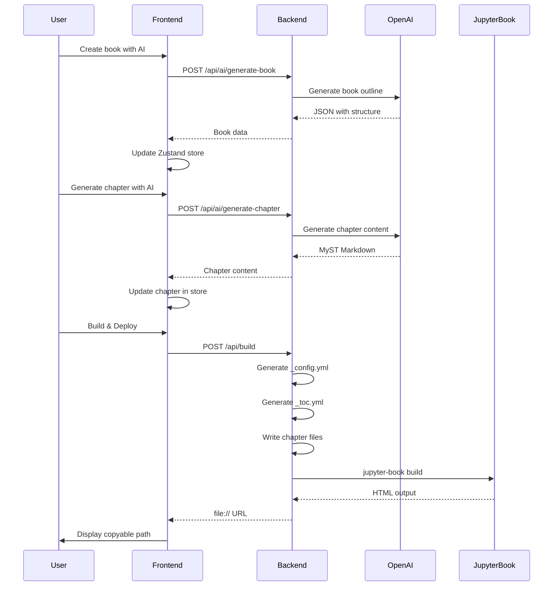

# LiquidBooks Architecture

## System Architecture Diagram

```mermaid
graph TB
    subgraph "Frontend - React + TypeScript"
        UI[User Interface]
        Dashboard[Dashboard Component]
        BookCreator[BookCreator Component]
        Editor[Editor Component]
        Monaco[Monaco Editor]
        Store[Zustand State Store]

        UI --> Dashboard
        UI --> BookCreator
        UI --> Editor
        Editor --> Monaco
        Dashboard --> Store
        BookCreator --> Store
        Editor --> Store
    end

    subgraph "Backend - FastAPI + Python"
        API[FastAPI Server]
        BuildEndpoint[/api/build]
        AIBookEndpoint[/api/ai/generate-book]
        AIChapterEndpoint[/api/ai/generate-chapter]

        JBBuilder[Jupyter Book Builder]
        ConfigGen[Config Generator]
        TOCGen[TOC Generator]
        ChapterWriter[Chapter Writer]

        API --> BuildEndpoint
        API --> AIBookEndpoint
        API --> AIChapterEndpoint

        BuildEndpoint --> ConfigGen
        BuildEndpoint --> TOCGen
        BuildEndpoint --> ChapterWriter
        BuildEndpoint --> JBBuilder
    end

    subgraph "AI Services"
        OpenAI[OpenAI API GPT-4]
        BookPrompt[Book Generation Prompt]
        ChapterPrompt[Chapter Generation Prompt]

        AIBookEndpoint --> BookPrompt
        AIChapterEndpoint --> ChapterPrompt
        BookPrompt --> OpenAI
        ChapterPrompt --> OpenAI
    end

    subgraph "Build System"
        JBBuilder --> Sphinx[Sphinx Builder]
        Sphinx --> HTML[HTML Output]
        Sphinx --> MyST[MyST Parser]
        MyST --> Features[Jupyter Book Features]

        Features --> Code[Code Blocks]
        Features --> Math[Math Equations]
        Features --> Admon[Admonitions]
        Features --> Quiz[Interactive Quizzes]
        Features --> Margin[Margin Notes]
        Features --> Dropdown[Dropdowns]
        Features --> Sidebar[Sidebars]
    end

    subgraph "Deployment (Optional)"
        GitHub[GitHub API]
        GitHubPages[GitHub Pages]

        BuildEndpoint -.->|Optional| GitHub
        GitHub --> GitHubPages
    end

    subgraph "Data Flow"
        Book[(Book Data)]
        TempFiles[Temporary Build Files]
        Output[Built Book HTML]

        Store --> Book
        Book --> BuildEndpoint
        BuildEndpoint --> TempFiles
        HTML --> Output
    end

    UI -->|HTTP Requests| API
    Output -->|file:// URL| UI

    style UI fill:#4f46e5,color:#fff
    style API fill:#10b981,color:#fff
    style OpenAI fill:#f59e0b,color:#fff
    style HTML fill:#3b82f6,color:#fff
    style GitHubPages fill:#6366f1,color:#fff
```

## Component Descriptions

### Frontend Layer

**UI Components:**
- **Dashboard**: Entry point for creating new books or viewing existing ones
- **BookCreator**: Form for creating books manually or with AI assistance
  - AI mode: Topic-based generation with system prompt customization
  - Manual mode: Traditional form input for title, author, description
- **Editor**: Main editing interface with Monaco editor
  - Chapter list sidebar with descriptions
  - Monaco code editor for Markdown editing
  - AI generation panel with feature selection
  - Build & Deploy button

**State Management:**
- **Zustand Store**: Centralized state for book data
  - Current book object
  - Current chapter selection
  - Chapter update operations
  - Chapter addition operations

### Backend Layer

**API Endpoints:**
1. **POST /api/build**
   - Receives book data
   - Generates Jupyter Book configuration files
   - Builds book with Sphinx
   - Returns file:// URL to built HTML

2. **POST /api/ai/generate-book**
   - Receives topic and optional system prompt
   - Generates book outline with chapter structure
   - Returns JSON with title, author, description, chapters

3. **POST /api/ai/generate-chapter**
   - Receives chapter context and feature flags
   - Generates full chapter content with selected features
   - Returns MyST Markdown content

**Build Pipeline:**
1. **Config Generation**: Creates `_config.yml` with book metadata
2. **TOC Generation**: Creates `_toc.yml` with chapter structure
3. **Chapter Writing**: Writes markdown files for each chapter
4. **Sphinx Build**: Executes `jupyter-book build` command
5. **Output**: Returns path to built HTML

### AI Integration

**OpenAI GPT-4:**
- **Book Generation**: Creates structured outlines with chapter descriptions
- **Chapter Generation**: Creates feature-rich content with:
  - Code examples with syntax highlighting
  - Mathematical equations (LaTeX)
  - Multiple admonition types
  - Interactive quizzes (jupyterquiz)
  - Advanced features: margin notes, dropdowns, sidebars, cards, epigraphs

**Feature Flags:**
- `include_code`: Add code examples
- `include_math`: Add equations
- `include_admonitions`: Add note/warning/tip boxes
- `include_quiz`: Add interactive quiz
- `include_images`: Add image placeholders

### Build System

**Jupyter Book:**
- Based on Sphinx documentation generator
- MyST Markdown parser for rich syntax
- Supports executable code blocks
- Generates static HTML sites

**Features Supported:**
- Code blocks with syntax highlighting
- Mathematical equations (MathJax/KaTeX)
- Admonitions (note, warning, tip, important, seealso, caution)
- Interactive quizzes (jupyterquiz extension)
- Margin notes
- Sidebars
- Dropdowns/toggles
- Cards/panels
- Epigraphs
- Proof/theorem blocks

### Data Flow



## Technology Stack

### Frontend
- **React 18**: UI framework
- **TypeScript**: Type safety
- **Vite**: Build tool and dev server
- **Zustand**: State management
- **Monaco Editor**: Code/markdown editor (VSCode engine)
- **Axios**: HTTP client

### Backend
- **Python 3.13**: Programming language
- **FastAPI**: Web framework
- **Pydantic**: Data validation
- **Jupyter Book 1.0.3**: Book builder
- **Sphinx**: Documentation generator
- **MyST Parser**: Markdown parser
- **OpenAI**: AI content generation
- **PyGithub**: GitHub API (optional deployment)

### Build & Deployment
- **Sphinx Book Theme**: Default book theme
- **JupyterQuiz 2.9.6**: Interactive quiz extension
- **GitHub Pages**: Optional hosting platform

## Key Design Decisions

1. **Temporary Build Directory**: Each build creates a unique temp directory to avoid conflicts
2. **ESM Imports**: Frontend uses `.js` extensions for TypeScript imports (ESM compatibility)
3. **YAML Quoting**: Book titles/authors are quoted to handle special characters (colons)
4. **Feature Flags**: Granular control over which Jupyter Book features to include
5. **Default Prompts**: Pre-configured system prompts shown in placeholders
6. **Dual Generation Modes**: Book creation (outline) vs. chapter generation (full content)
7. **In-Browser Preview**: Uses file:// URLs for local preview (no server needed)

## Security Considerations

- OpenAI API key stored in `.env` file (not committed to git)
- GitHub token stored in `.env` file (optional, for deployment)
- CORS configured for localhost development
- No authentication (MVP - add auth for production)
- Temporary files cleaned up on error

## Future Enhancements

- User authentication and multi-user support
- Database persistence (PostgreSQL)
- Real-time collaboration (WebSockets)
- PDF export
- Custom themes
- Version control/history
- Book templates library
- Mermaid diagram support
- Embedded videos
- Interactive visualizations (Plotly, Bokeh)
